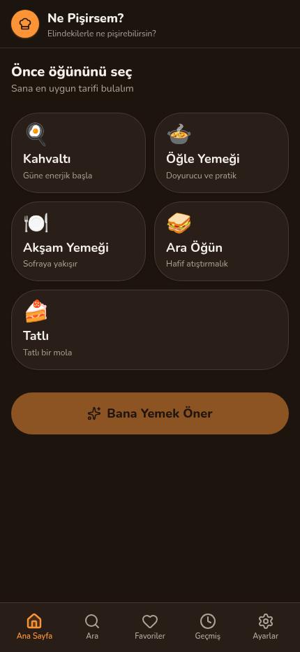
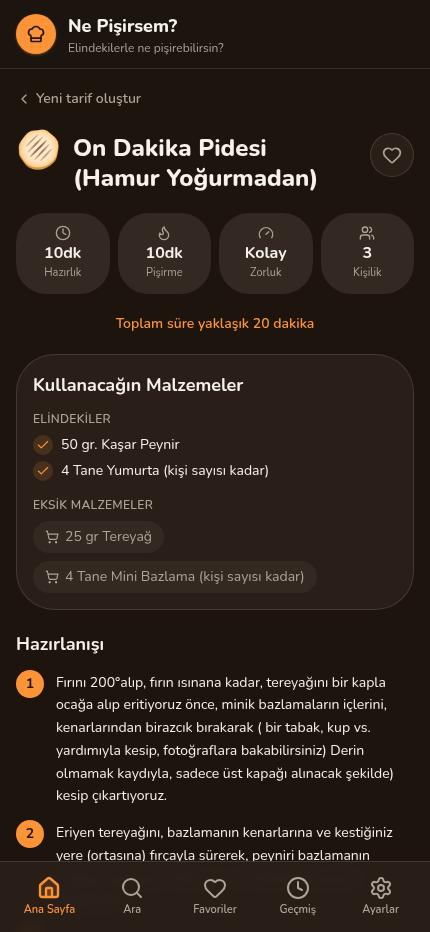
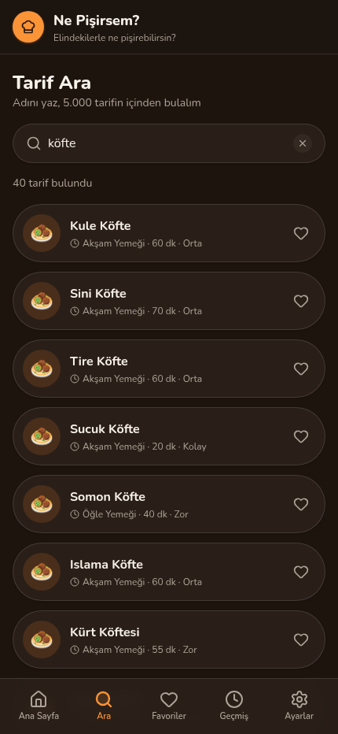
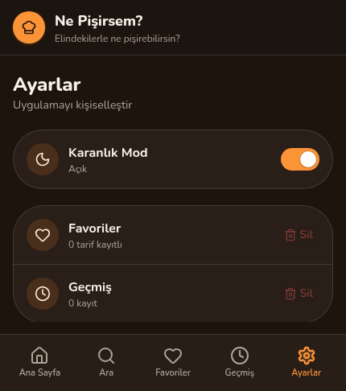

<div align="center">

# 🍳 Ne Pişirsem?

**Elindeki malzemeleri yaz, ne pişirebileceğini bul.**

Kahvaltı, öğle, akşam, ara öğün ve tatlı için 5.000 Türkçe tarif — tamamen çevrimdışı, reklamsız, izleyicisiz (tracker).

[](https://github.com/tospaemre/yemek-asistani/releases/latest)
[](https://github.com/tospaemre/yemek-asistani/actions/workflows/android.yml)


[**📲 APK indir**](https://github.com/tospaemre/yemek-asistani/releases/latest) · [Nasıl çalışır](#nasıl-çalışır) · [Katkıda bulun](#katkıda-bulunma)

</div>

<br>

<table>
<tr>
<td></td>
<td></td>
<td></td>
<td></td>
</tr>
</table>

## Özellikler

- 🥘 **5.000 tarif** — kahvaltı, öğle, akşam, ara öğün, tatlı
- 🧺 **Malzemeye göre öneri** — elindekileri yaz, uygun tarifler çıksın; her tarifte neyin elinde olduğu, neyin eksik olduğu ayrı ayrı gösterilir
- 🔍 **Ada göre arama** — "karnıyarık" yaz, onlarca çeşidini gör; Türkçe karakter yazmasan da bulur (`kofte` → `Köfte`)
- ⏱️ Her tarifte hazırlık/pişirme süresi, kişi sayısı ve zorluk derecesi — **veriden**, tahmin değil
- ❤️ Favoriler ve geçmiş, cihazda saklanır
- 🌙 Karanlık mod
- 📴 **%100 çevrimdışı** — sunucuya istek atılmaz, veri toplanmaz, reklam ve izleyici (tracker) yoktur
- 🔓 Hiçbir izin istemez

## Nasıl çalışır

Uygulama bir **Next.js** (React) sitesi olarak yazılıyor, statik dosyalara dışa aktarılıyor ve **Capacitor** ile bir Android kabuğunun içine gömülüyor. Öneri motoru bir sunucuya bağlanmaz — tarifler `public/recipes.json` içinde uygulamayla birlikte gelir, eşleştirme cihazda çalışır.

```
Next.js (React + Tailwind)  →  statik dışa aktarım (out/)  →  Capacitor  →  Android APK
```

| Katman | Teknoloji |
|---|---|
| Arayüz | Next.js 16, React 19, Tailwind CSS 4 |
| Mobil kabuk | Capacitor 8 |
| Türkçe eşleştirme | `lib/ingredients.ts` — ünsüz yumuşaması, ek ayıklama, normalizasyon |
| Tarif verisi | `public/recipes.json`, [VERI-LISANS.md](VERI-LISANS.md) |
| Dağıtım | GitHub Actions → imzalı APK → GitHub Releases |

## İndir

En güncel sürüm her zaman **[Releases](https://github.com/tospaemre/yemek-asistani/releases/latest)** sayfasında. APK'yı indir, telefonunda aç, "bilinmeyen kaynak" izni verip kur.

Her yeni sürüm aynı imza anahtarıyla imzalanır — telefonun bunu güncelleme olarak görür, eskiyi silmen gerekmez.

## Geliştirme ortamı

<details>
<summary>Yerelde çalıştırmak / APK derlemek için gerekenler</summary>

**Gereksinimler:** Node 22+, JDK 21, Android SDK (`compileSdk 36`)

```bash
git clone https://github.com/tospaemre/yemek-asistani.git
cd yemek-asistani
npm install

# Tarayıcıda geliştirme
npm run dev

# Statik dışa aktarım + Android projesine aktarım
npm run build
npx cap sync android

# Debug APK
cd android && JAVA_HOME=/path/to/jdk-21 ./gradlew assembleDebug
```

Sürüm (release) APK'sı için imza anahtarı gerekir — bkz. `android/app/build.gradle` içindeki `signingConfigs`. `.github/workflows/android.yml`, bir sürüm etiketi (`vX.Y.Z`) push edildiğinde bunu otomatik yapar ve APK'yı Releases'e ekler.

</details>

## Tarif verisi

Tarifler elle yazılmadı; açık lisanslı **[turkish-recipes-175K](https://huggingface.co/datasets/mmkocak/turkish-recipes-175K)** veri setinden (Apache-2.0) türetildi ve 5.000 tarife süzüldü. Neyin nasıl işlendiği, hangi kuralların (zorluk, öğün eşlemesi, emoji) kullanıldığı **[VERI-LISANS.md](VERI-LISANS.md)** dosyasında ayrıntılı yazıyor.

## Katkıda bulunma

1. Depoyu **fork**'la
2. Değişikliğini bir dalda yap: `git checkout -b ozellik/aciklama`
3. **Pull request** aç

Sorun bildirimi ve öneriler için [Issues](https://github.com/tospaemre/yemek-asistani/issues) sekmesini kullanabilirsin.

## Lisans

Tarif verisi Apache-2.0 ile lisanslıdır, kaynağı [VERI-LISANS.md](VERI-LISANS.md) içinde belirtilmiştir. Uygulama kodunun lisansı henüz belirlenmedi.
